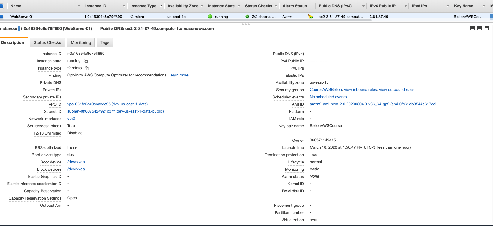
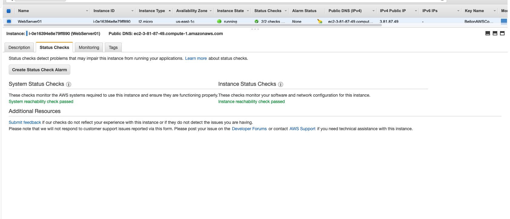
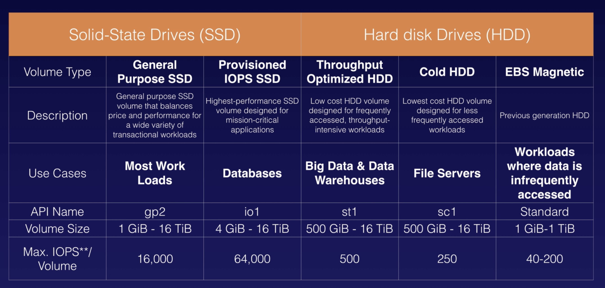

# Aws Certified Solutions Architect

## Section 4 - EC2 (Elastic Compute Cloud)

**What is EC2:**

* Web service;
* Resizable compute capacity;
* Reduce the boot time;

**Pricing:**

* On Demand:
  * fixed rate by hour/minute;
* Reserved:
  * contract by time (1-3 year);
  * discounts provides for reservation;
* Spot:
  * bid a price for instance capacity; 
  * `if terminated by EC2 **not** charged by partial hour`;
  * `if terminate by user **will be** charged by partial hour`
* Dedicated Host:
  * physical ec2 host to best performance;
  * Follow law or some services (like Oracle) when can not be virtualize

## Launch a EC2

Lab using AWS Console to create a EC2

Quick tip: `Zone A for a login not same zone A for other login in AWS Console`
Creating a EC2 and by a reserved instance.

**Description:**

**Monitor:**

**Status:**

**Volumes Types:**

* Root: 
  * SSD (gp1 or io1)
  * Magnetics
* Delete on terminaton 
* `Encryption? -  Can Encryption Root Volume`

**Tips:**

* Termination off by default;
* EBS backed, default to delete root on terminated;
* EBS root CAN be encrypted;
* Add adicional volumes (and encrypted);

## Security Groups

Lab creating a security group and manage IPs and port access

**Tips:**

* All inbound traffic  is blocked by default;
* All Outbound traffic is allowed;
* Changes take effect immediately;
* Any number of security group in a EC2;
* Any number of EC2 in security group;
* Security groups are **STATEFUL** (if active any port in INBOUND , same port is activated in OUTBOUND)
* Cannot block specific IP , use Network Access Control Lists for that.
* Not set DENY rules!

## EBS (Elastic Block Store)

Lab creating a EC2 and attach volumes to use.
A block store on cloud, a hard disk on cloud

**5 Types**: 

Move a EBS to other zone:

1. Create a Snapshot from the EBS;
2. Create a image from snapshot (tip:`warning the virtualize tipe PV or HVM`);
3. Launch a new EC2 using this image on the new region (security group)

`Can Copy AMI to region from one region to other`

**Tips:**

* Volumes EBS are virtual HDs
* Snapshots are on S3 anda are a photo o disk
* Snapshots are incremental, only changed block are backed
* Create a snapshot from the root, best practices is stop the instance before
* Can do when running
* Can create AMI from Snapshots
* Can resize volumes on the fly
* Volume on the same zone

## AMI (IMAGES)

**Types of AMI:**

* Region
* OS
* x32/64
* Permission
* Root Devices
  * EBS Volume
  * Instance Store Volumes:NOT PERSISTE THE DATA!! ephemeral storage !

**Tips:**:

* Instante Store are ephemeral
* Instance Store cannot be **stopped** , if fail, you lose your data !
* EBS can be stopped and dont lose the data !
* Can reboot both
* Root will be deleted on terminated !

## ENI x ENA x EFA

The network adapter on EC2

**Tips:**:

* ENI - Elastic Network Interface
  * For basic networking
  * Separate production from log network
  * Multiples ENIs
* EN - Enhanced Networking
  * Speeds 10Gbps and 100 Gbps, need a high throughput;
* EFA  - Elastic Fabric Adapter
  * High Performance Computing (HPC) and Machine Learning
  * OS by-pass

## Encrypted Root Device Volumes and Snapshots

Lab to show all create a Encrypted volume By Snapshots

**How move to a encrypted:**

1.Create a Volume (launch a EC2)
2.Take Snapshot
3.Copy Snapshot to Encrypted Snapshot;
4.Create a AMI from Encrypted Snapshot; 
5.Launch from AMI

**Tips:**:

* Snapshots ofs Encrypted volumes are Encrypted
* Volumes restores from encrypted snapshot are Encrypted too
* Share snapshot only if Unencrypted, can be made public to share to other AWS Accounts
* Can Encrypted root on launch a ec2

## CloudWatch

A monitor performance tool from AWS

* Compute
  * EC2
  * Autoscaling
  * Elastic
  * Route53

* Storage & CD
  * EBS
  * Gateway
  * Cloud Front

Host level metrics:

* CPU
* Network
* Disk
* Status Check

CloudTrail -  auditing - Camera - who and when  
CloudWatch -  performance - Gymn - how

1 min delay 
Create alarms to trigger 

Create Alarms by email and thresholds
Can create dashboards global or regions

Standards Monitoring = 5 minutes
Detailed Monitoring = 1 minutes

Events - state changes
Logs - agg, monitor and store logs

## The AWS Command Line (CLI)

* Programmatic Access for user to use CLI
* Access and Secret key

`Trick: command line dont work on video to a region #lol.`

* Using AWS CLI inside a EC2
* Show .aws folder 
* Credentials file
* Interact with AWS in work using CL
* Need setup a IAM
`Commands not in exame, but in real life YES!!`

## Using IAM Roles With EC2

* Show the roles
* Create a new role to admin
* Attach a role to a ec2
* Access ec2 and read s3 from ec2
* Roles are more security between access and secret key
* Roles easier to manage
* Be assigner do a EC2 after create
* Roles are universal

## Using Boot Strap Scripts

* Automate EC2 deploy commands
* Give a role can access S3
* Start whit a shebang (#!)
* Put commands to run!

## EC2 Instance Meta Data

* Get bootstrap to a text from a IP
* Using a ec2 ip to get metadata from ec2
* Get information from instance
  * 169.254.169.254/latest/meta-data
  * 169.254.169.254/latest/user-data

## Elastic File System (EFS)

* EFS growing and shrinking when files are add or removed
* Can shared to multiples EC2
* Life cycle like S3
* Can be encrypted
* Create EC2 with efs tool.
* In security group to communicate with NFS protocol with ec2 security group
* Mount EFS using commands when in ssh console in two ec2 machines on html source.
* Change file in ec2 replicate to other ec2.

Tips:

* Supports Network File System v4 (NFS) protocol
* Pay to use storage (no pre-provisioning required)
* Scale to petabytes
* Support thousands concurrent NFS connections
* Storage across multiple AZ
* Read After Write Consistency
* For Linux and Unix
* Need distributed and highly resilient

## FSX for Windows & FSX for Lustre

* For Windows
  * For Windows Server Message Block
  * For Windows App
  * Supports AD
  * Microsoft Stuffs centralized !

* For Lustre
  * Intense compute-intensive
  * Machine learning
  * HPC
  * Can store data on S3

## EC2 Placement Groups

3 Types:

* Clustered Placement
  * Single AZ
  * Only some instance
  * Low network latency and hight throughout

* Spread Placement
  * Distinct hardware
  * Small number instance im group
  * Individual Critical EC2 instance
  * Only 7 instance on same AZ

* Partitioned Placement
  * Logical Segments
  * Same rack from some ec2
  * Multiples EC2 instances HDFS, HBase and Cassandra

* Can span multiples AZ
* Only some instance can be launch
* Name unique from AWS account
* Homogenous instance
* Dont Merge
* Move a EC2 stopped to a group, AWS CLI or SDK

## AWS WAF

Control Access from the content.

* Use AWS WAF
  * IPs attacks
  * SQL injection
  * Region access control
* Use Network ACLs

